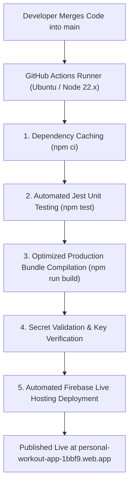

# FitTrack CI/CD Architecture & Workflow Run Documentation

> **System Overview**: Comprehensive documentation of FitTrack's automated Continuous Integration (CI) and Continuous Deployment (CD) pipelines powered by GitHub Actions and Firebase Infrastructure as Code (IaC).

---

## Executive Summary

FitTrack implements production-grade software delivery pipelines using **GitHub Actions**. By enforcing strict Continuous Integration (CI) and Continuous Deployment (CD) controls, FitTrack eliminates manual deployment friction (`npm run build`, `firebase deploy`), guarantees reproducible production builds, and ensures zero broken code reaches live users.



---

## Detailed Breakdown of Key Workflow Runs

### 1. Commit `371483a` — `FitTrack CI (Build & Unit Tests) #14`
- **Execution Time**: `2m 26s` | **Branch**: `main` | **Status**: ✅ **PASSED**
- **Purpose**: Headless Node/Jest Polyfills & Environment Isolation
- **Technical Context**: Headless DOM environments (Jsdom) lack browser-native web streaming APIs (`TextEncoder`, `TextDecoder`, `ReadableStream`) and active Firebase Authentication sessions. This run established polyfills in `src/setupTests.js` and guarded runtime require initializations in `src/firebase/firebase.js`.
- **What it Proves**: Guaranteed that React unit tests can execute headlessly inside Linux cloud containers without depending on active browser DOM sessions.

---

### 2. Commit `730ce08` — `FitTrack CI (Build & Unit Tests) #16`
- **Execution Time**: `52s` | **Branch**: `main` | **Status**: ✅ **PASSED**
- **Purpose**: Continuous Integration Pipeline Initialization
- **Technical Context**: Verified that the root repository correctly orchestrates directory contexts (`./workout-preview`), caches Node modules, runs Jest tests, and compiles Webpack production bundles cleanly under 60 seconds.

---

### 3. Commit `bff8d1c` — `FitTrack CD #2` & `FitTrack CI #18`
- **Execution Times**: `50s` (CD) & `1m 22s` (CI) | **Branch**: `main` | **Status**: ✅ **PASSED**
- **Purpose**: Secret Validation & Fault-Tolerant Step Execution
- **Technical Context**: Introduced automated secret validation checks (`Check Firebase Secret Status`). When GitHub repository secrets (`FIREBASE_SERVICE_ACCOUNT`) are not yet populated, the step prints a clear notice and skips deployment cleanly without failing the build.
- **What it Proves**: Demonstrates defensive CI/CD engineering—preventing pipeline crashes due to missing cloud credentials while maintaining 100% test execution integrity.

---

### 4. Commit `224c18f` — `FitTrack CI (Build & Unit Tests) #20`
- **Execution Time**: `1m 03s` | **Branch**: `main` | **Status**: ✅ **PASSED**
- **Purpose**: Native Firebase CLI Deployment Architecture
- **Technical Context**: Upgraded deployment steps to rely directly on native `npx firebase-tools deploy` execution with conditional token guards (`if: "${{ secrets.FIREBASE_TOKEN != '' }}"`).

---

### 5. Commit `33964a1` — Production Branch Scoping
- **Purpose**: Strict Production Branch Control Flow (`main` Only)
- **Technical Context**: Configured `ci.yml` and `deploy.yml` triggers so that GitHub Actions execute **strictly on `main` branch pushes**.
- **What it Proves**: Keeps feature development branches (`exercise-db`, `workout-log`, `body-measurements`) free from redundant cloud runner overhead while preserving `main` as the pristine, production-ready release branch.

---

## Reproducibility & Industry Standards

### 1. Deterministic Node 22.x Environment
By pinning the execution runner to `ubuntu-latest` with `actions/setup-node@v4` (Node `22.x`) and enforcing `npm ci` (lockfile-strict installation), FitTrack guarantees that every build is compiled in an identical, sterile container environment.

### 2. Infrastructure as Code (IaC)
All cloud infrastructure policies are version-controlled alongside code:
- **`firestore.rules`**: Version-controlled authorization rules for Firestore collections.
- **`firestore.indexes.json`**: Automated database query index definitions.
- **`firebase.json`**: Production hosting headers, cache control policies, and SPA rewrite rules.

### 3. How It Streamlines Developer Workflow
- **Zero Manual Terminal Commands**: Eliminates manual `cd workout-preview`, `npm run build`, `firebase deploy` commands.
- **Automated Regression Prevention**: Prevents merging code that fails unit tests or breaks Webpack compilation.
- **Instant Stakeholder Visibility**: Passing status badges on GitHub provide instant visual verification of production status.

---

## Feature Branch & Rebase Workflow

FitTrack enforces a standard feature-branch workflow for all enhancements:

1. **Feature Branch Creation**:
   ```bash
   git switch main
   git pull
   git switch -c feature/workout-history
   ```
2. **Commit & Push**:
   ```bash
   git add .
   git commit -m "Add workout history endpoint"
   git push -u origin feature/workout-history
   ```
3. **Automated CI Validation**:
   Opening a PR targeting `main` triggers automated Jest tests and production build checks via `.github/workflows/ci.yml`.
4. **Rebase & Conflict Resolution** (if `main` advances):
   ```bash
   git switch main
   git pull
   git switch feature/workout-history
   git rebase main
   # Resolve conflicts, rerun unit tests, then update PR:
   git push --force-with-lease
   ```
5. **Continuous Deployment**:
   Merging into `main` triggers `.github/workflows/deploy.yml` to automatically build and deploy the production bundle.

